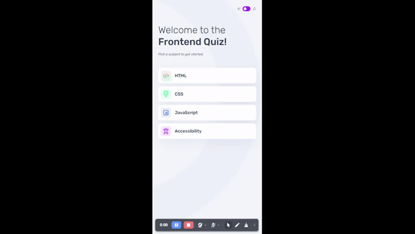
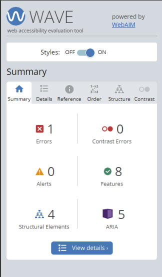
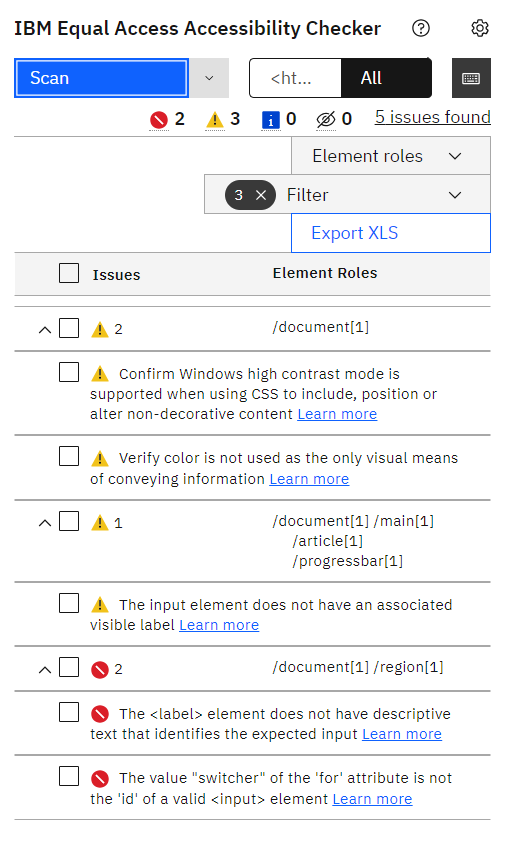
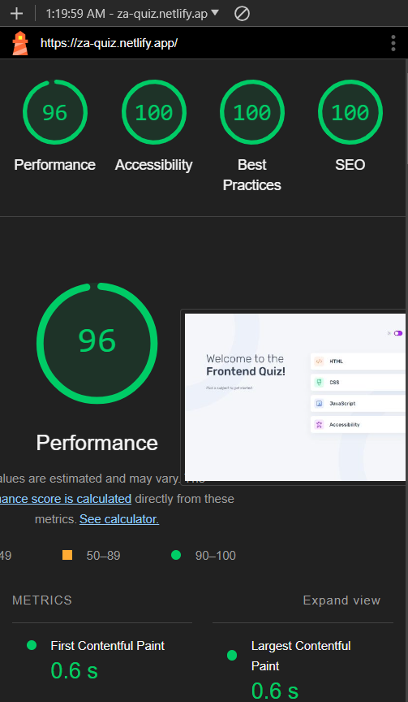
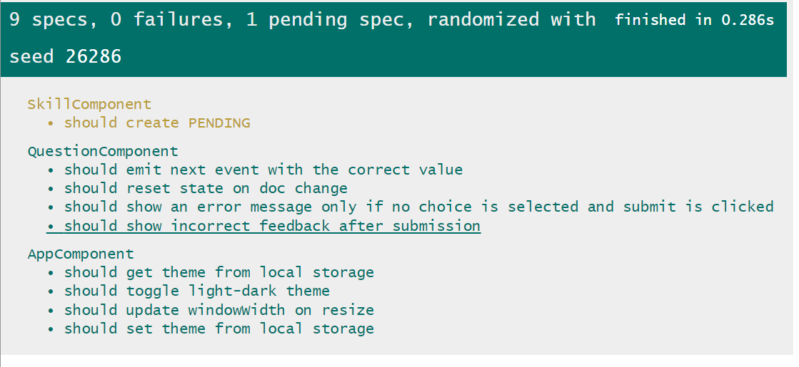
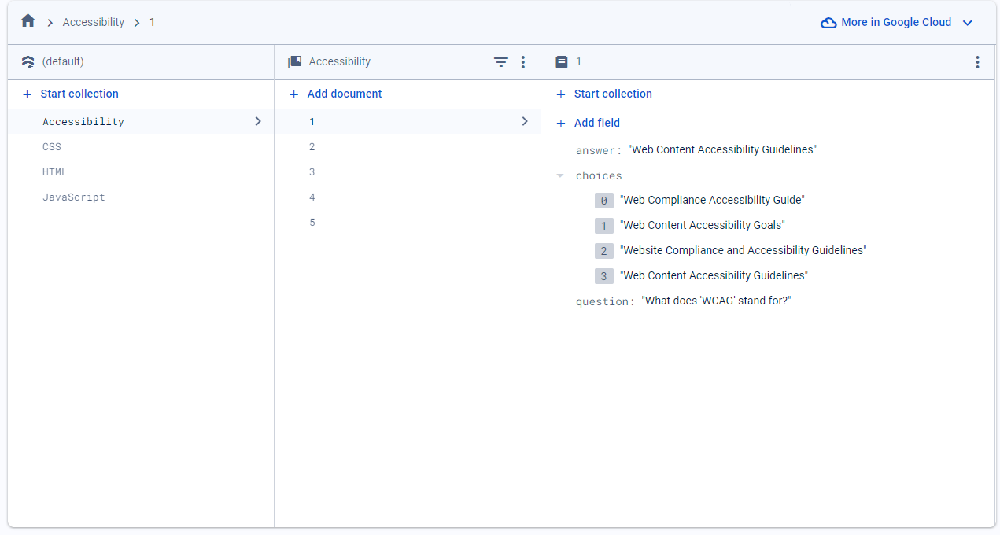

# Frontend Mentor - Quiz App - React Solution

This is a solution to the [Frontend quiz app challenge on Frontend Mentor](https://www.frontendmentor.io/challenges/frontend-quiz-app-BE7xkzXQnU). Frontend Mentor challenges help you improve your coding skills by building realistic projects.

## Table of Contents

- [Overview](#overview)
  - [Figma Design](#figma-design)
  - [Outcome](#outcome)
- [Technologies](#technologies)
- [Features](#features)
- [Setup](#setup)
- [Links](#links)
- [Testing](#testing)
  - [Accessibility](#accessibility)
  - [Unit Testing](#unit-testing)
- [Screenshots](#screenshots)
- [Retrospectives](#retrospectives)
- [About The Author](#about-the-author)
- [Contributing](#contributing)
- [License](#license)

## Overview

### Figma Design

<p align="center">

</p>

### Outcome

<p align="center">

</p>

## Technologies

The technologies used in this project are:

* HTML & Tailwind & TypeScript
* React 18
* Unit testing (Vitest)
* Firebase
* Libraries: React Router, Framer Motion, ClassNames, React Firebase

## Features

* **Responsive Design**: Ensures the App looks great on all devices.
* **Accessibility**: Built with accessibility in mind.
* **Animations**: Smooth animations for all app interactions.
* **Unit testing**: Comprehensive unit tests to ensure code reliability.
* **Pixel Perfect**: Almost identical to figma design.
* **Innovative Solution**: Created innovative solution to complex challenge, demonstrating creativity and problem-solving skills.

## Setup

To run this app in development mode open the terminal and write the following:

```shell  
git clone https://github.com/Zakaria9375/quiz-app-react.git 
cd quiz-app-react
npm install 
 
npm run dev
```

## Links

* [Challenge Page](https://www.frontendmentor.io/challenges/frontend-quiz-app-BE7xkzXQnU)
* [Live Demo](https://za-quiz-react.netlify.app/)
* [Angular Solution for this challenge](https://github.com/Zakaria9375/quiz-app-angular)

## Testing

### Accessibility

This app has been crafted with a focus on accessibility, utilizing the Accessibility Linter, IBM Equal Access Accessibility Checker extension, and WCAG extension to adhere to accessibility best practices. Key features include: Zooming,
Keyboard-only navigation, Static code analysis, Aria rules compliance, and Semantic HTML.

### Unit Testing

To run and execute all the unit tests defined in the project after setting the app in development mode, open a new terminal and write the following:

```shell
npm run test:ui
```

## Screenshots

<details>
  <summary><b>Some of Accessibility Tests Screenshots</b></summary>
<p align="center">

</p>

<p align="center">

</p>
</details>

<details>
  <summary><b>Lighthouse Report</b></summary>
<p align="center">

</p>
</details>

<details>
  <summary><b>Unit Tests Screenshots</b></summary>
<p align="center">

</p>
</details>

<details>
  <summary><b>Firebase</b></summary>
<p align="center">

</p>
</details>

## About the Author

>  In every project I develop, I focus on improving code quality and incorporating new techniques into my development process. I strive to learn from my mistakes by addressing them directly and applying those lessons to future projects. My goal is to continuously refine and enhance ***my standard approach to project development***.

* Portfolio - [Zakaria Ali](https://zaportfolio.netlify.app/)
* Frontend Mentor Profile - [@Zakaria9375](https://www.frontendmentor.io/profile/Zakaria9375)
* Project by - [Frontend Mentor team](https://www.frontendmentor.io/)

## Contributing

**Want to contribute?** *Great!* Here’s how you can help:

1. Fork the repo and create your branch from `main`.
2. Make your changes and test.
3. Issue that "pull" request!

## License

MIT License  
Copyright (c) 2024-present, Zakaria Ali
